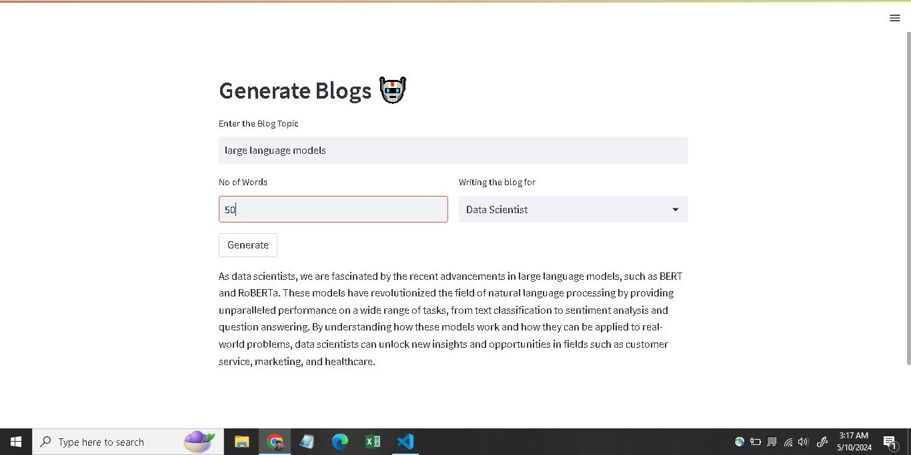

# Blog Content Generator

This application leverages the power of the LLama 2 Large Language Model (LLM) to generate high-quality blog content. Users can input a blog topic, specify the number of words, and select a writing style. The LLama 2 model generates contextually relevant and coherent blog posts based on these inputs.

## Features

- **Advanced LLM Integration**: Utilizes the LLama 2 model for sophisticated content generation.
- **User-friendly Interface**: Built with Streamlit for an intuitive and easy-to-use interface.
- **Customizable Output**: Generates content tailored to different writing styles: Researchers, Data Scientists, and Common People.

## Installation

1. Clone the repository:
    ```sh
    git clone https://github.com/nabeelahmad123/content_generator.git
    cd content_generator
    ```

2. Install the required packages:
    ```sh
    pip install -r requirements.txt
    ```

3. Ensure you have the LLama 2 model file:
    - Download the model file and place it in the `models` directory:
      ```
      models/llama-2-7b-chat.ggmlv3.q8_0.bin
      ```

## Usage

1. Run the Streamlit application:
    ```sh
    streamlit run app.py
    ```

2. Open your web browser and go to:
    ```
    http://localhost:****
    ```

3. Enter the blog topic, number of words, and select the writing style.

4. Click on the "Generate" button to get the generated blog content.

## Example



## How It Works

This application uses the LLama 2 model, a state-of-the-art large language model, to generate blog content. The LLama 2 model is capable of understanding and generating human-like text, making it ideal for creating tailored blog posts. Here's a brief overview of the code:

### Code Overview

```python
import streamlit as st
from langchain.prompts import PromptTemplate
from langchain.llms import CTransformers

# Function to get response from LLama 2 model
def getLLamaresponse(input_text, no_words, blog_style):
    llm = CTransformers(
        model='models/llama-2-7b-chat.ggmlv3.q8_0.bin',
        model_type='llama',
        config={'max_new_tokens': 256, 'temperature': 0.01}
    )
    
    # Prompt Template
    template = """
        Write a blog for {blog_style} job profile for a topic {input_text}
        within {no_words} words.
    """
    
    prompt = PromptTemplate(
        input_variables=["blog_style", "input_text", 'no_words'],
        template=template
    )
    
    # Generate the response from the LLama 2 model
    response = llm(prompt.format(blog_style=blog_style, input_text=input_text, no_words=no_words))
    print(response)
    return response

# Streamlit app configuration
st.set_page_config(
    page_title="Generate Blogs",
    page_icon='🤖',
    layout='centered',
    initial_sidebar_state='collapsed'
)

st.header("Generate Blogs 🤖")

input_text = st.text_input("Enter the Blog Topic")

# Creating two more columns for additional fields
col1, col2 = st.columns([5, 5])

with col1:
    no_words = st.text_input('No of Words')
with col2:
    blog_style = st.selectbox('Writing the blog for', ('Researchers', 'Data Scientist', 'Common People'), index=0)
    
submit = st.button("Generate")

# Final response
if submit:
    st.write(getLLamaresponse(input_text, no_words, blog_style))
